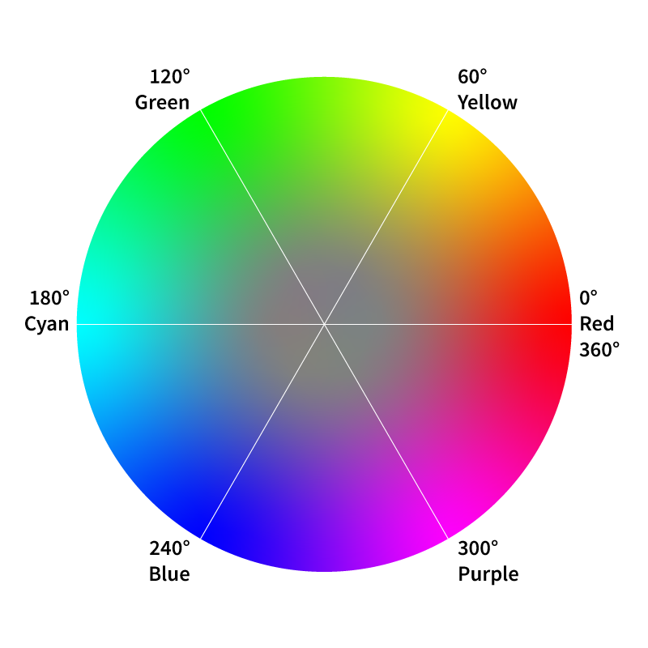

## Warna pada CSS (Cascading Style Sheets)

Dengan CSS, Anda dapat menerapkan warna pada elemen HTML, seperti teks, latar belakang, dan border. Anda dapat menggunakan format warna HEX, RGB, HSL, atau kata kunci warna.

RGB mendefinisikan intensitas warna merah, hijau, dan biru, sedangkan format HEX menggunakan kombinasi enam digit heksadesimal, yang memungkinkan desainer membuat tampilan web yang menarik dan dinamis.

## Cara Memilih Warna pada CSS

Berikut beberapa cara yang bisa anda terapkan untuk memilih sebuah warna:

1. **Menggunakan Kode HEX**: Anda dapat memilih warna hijau dengan menentukan kode HEX seperti contoh di bawah ini:

```html
  <style>
    h1 {
      color: #33FF33;
    }
  </style>
```

Pada kode HEX, setiap pasangan digit mewakili intensitas dari warna merah, hijau, dan biru (RGB) dengan rentang dari 00 hingga FF (0 hingga 255 dalam desimal):

- 2 digit pertama (#33FF33) mewakili intensitas merah. Dalam contoh ini, intensitasnya rendah, yaitu 33 (51 dalam desimal).
- 2 digit tengah (#33FF33) mewakili intensitas hijau. Dengan nilai FF (255 dalam desimal), ini berarti hijau ditampilkan dengan intensitas penuh.
- 2 digit terakhir (#33FF33) mewakili intensitas biru. Sama seperti merah, nilainya rendah di sini, yaitu 33.

Jadi, kode ini menghasilkan warna hijau terang, karena hijau memiliki intensitas paling tinggi sementara merah dan biru memiliki intensitas rendah.

2. **Menggunakan Format RGB**: Untuk memilih warna biru muda menggunakan format RGB, Anda bisa menuliskannya seperti ini:

```html
  <style>
    h1 {
      color: rgb(0, 128, 255);
    }
  </style>
```

Pada format RGB, setiap nilai mewakili intensitas warna merah, hijau, dan biru dengan rentang angka dari 0 hingga 255:

- Nilai pertama rgb(**0**, 128, 255) mewakili intensitas merah. Di sini nilainya 0, artinya tidak ada warna merah.
- Nilai kedua rgb(0, **128**, 255) mewakili intensitas hijau. Nilainya 128, menunjukkan hijau memiliki intensitas sedang.
- Nilai ketiga rgb(0, 128, **255**) mewakili intensitas biru. Dengan nilai 255, biru ditampilkan dengan intensitas penuh.

Kombinasi ini menghasilkan warna biru muda, karena biru sangat dominan sementara hijau sedang, dan tidak ada warna merah.

3. **Menggunakan Format HSL**: Jika ingin menggunakan format HSL untuk menentukan warna hijau tua, contoh penggunaannya adalah sebagai berikut:

```html
  <style>
    h1 {
      color: hsl(120, 100%, 25%);
    }
  </style>
```

Pada format HSL (Hue, Saturation, Lightness):

<!-- Kok gak muncul? -->


- Nilai pertama hsl(**120**, 100%, 25%) adalah hue (corak warna), diukur dalam derajat dari 0 hingga 360. Nilai 120 menunjukkan warna hijau.
- Nilai kedua hsl(120, **100%**, 25%) adalah saturation (kejenuhan), yang menentukan seberapa murni warna tersebut. Dengan 100%, warna hijau sangat jenuh atau murni.
- Nilai ketiga hsl(120, 100%, **25%**) adalah lightness (kecerahan), yang mengontrol kegelapan atau kecerahan warna. Dengan 25%, warna ini cenderung gelap.

Kombinasi ini menghasilkan hijau tua yang intens, karena hue-nya tepat pada warna hijau, dengan kejenuhan penuh dan tingkat kecerahan rendah.

4. **Menuliskan Kata Kunci**: Anda juga bisa menggunakan kata kunci warna seperti 'chocolate' untuk memberikan warna coklat pada teks:

```html
  <style>
    h1 {
      color: chocolate;
    }
  </style>
```

Dalam penggunaan kata kunci warna, Anda cukup menuliskan nama warna yang sudah ditentukan oleh CSS:

- Kata kunci pertama color: **chocolate**; secara langsung menggunakan nama warna coklat. Nama ini sudah didefinisikan dalam spesifikasi CSS dan dapat digunakan tanpa perlu menyebutkan nilai RGB atau HEX.

:::tip
Untuk mengetahui semua kata kunci warna, [Kunjungi link berikut](https://web.dev/learn/css/color?continue=https%3A%2F%2Fweb.dev%2Flearn%2Fcss%23article-https%3A%2F%2Fweb.dev%2Flearn%2Fcss%2Fcolor#color_keywords).
:::

Menggunakan kata kunci warna memberikan cara yang cepat dan mudah untuk menetapkan warna pada elemen tanpa perlu menghitung nilai numerik, sehingga cocok untuk penggunaan yang sederhana.


## Tantangan

Ubah warna `h1` menjadi warna merah gelap dari Kata Kunci `darkred` menjadi kode HEX `#8B0000`


## Kesimpulan

Dalam CSS, Anda dapat menerapkan warna pada elemen HTML menggunakan berbagai format, termasuk HEX, RGB, HSL, dan kata kunci warna. Setiap format memiliki cara unik untuk menentukan intensitas warna.

Memahami cara memilih warna yang tepat memungkinkan Anda untuk menciptakan tampilan yang menarik dan dinamis pada halaman web, memudahkan penataan elemen sesuai kebutuhan desain.
