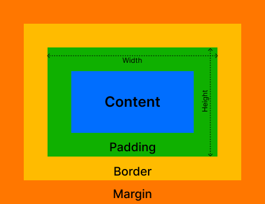

## Apa itu CSS Box Model?

Dalam CSS, setiap elemen HTML dianggap sebagai sebuah kotak (box). Box model ini merepresentasikan bagaimana elemen-elemen tersebut ditampilkan di halaman web, termasuk ukuran, posisi, dan jarak antar elemen. Setiap kotak terdiri dari beberapa komponen utama.

## Komponen Utama Box Model


1. **Content**: Bagian di dalam kotak yang berisi konten sebenarnya dari elemen, seperti teks, gambar, atau elemen lainnya. Pada konten sendiri memiliki height dan width yang merepresentasikan dimensi konten.
2. **Padding**: Ruang kosong di sekitar konten, namun masih di dalam border.
3. **Border**: Garis yang mengelilingi konten dan padding.
3. **Margin**: Ruang kosong di luar border, membatasi antara kotak dengan elemen lainnya.


## Cara Mengukur Elemen dengan Box Model

Ketika kita mengatur ukuran atau posisi suatu elemen, kita sebenarnya sedang mengatur keempat komponen box model ini. Misalnya, jika kita ingin membuat sebuah kotak dengan lebar 200px, kita harus mempertimbangkan tidak hanya lebar kontennya, tetapi juga lebar padding, border, dan margin yang akan ditambahkan.

```css
div {
  width: 200px;
  height: 100px;
  padding: 20px;
  border: 2px solid blue;
  margin: 10px;
}
```
Dapat dilihat pada contoh elemen yang diberikan style diatas. Karena diberikan `width: 200px;`, bukan berarti ukuran elemen tersebut adalah `200px`, tetapi perhatikan juga lebar padding, border, dan margin yang ditambahkan.

## Tantangan
Tambahkan atribut css pada selector `.box` di dalam file `assets/css/style.css` agar:
- Memiliki lebar `300px`.
- Memiliki tinggi `200px`.
- Memiliki padding `10px`.
- Memiliki margin `30px` dari elemen di sekitarnya.


