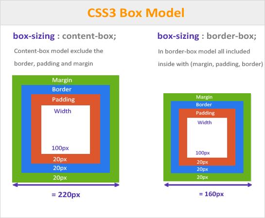

## Memahami Box-Sizing

**Box-sizing** adalah properti CSS yang sangat berguna untuk mengatur bagaimana lebar dan tinggi suatu elemen dihitung. Secara default, browser menghitung lebar dan tinggi suatu elemen berdasarkan kontennya saja (content-box). Namun, dengan menggunakan properti box-sizing, kita dapat mengubah perhitungan ini agar mencakup padding dan border.

### Perbedaan box-sizing: content-box dan box-sizing: border-box


### 1. box-sizing: content-box
`content-box` adalah nilai default dari box-sizing. Lebar dan tinggi yang kita tetapkan hanya berlaku untuk konten di dalam elemen. Padding dan border akan ditambahkan di luar ukuran yang kita tetapkan.

**Contoh**: Jika kita mengatur lebar sebuah div menjadi 200px, dan menambahkan padding 10px, lebar total div tersebut akan menjadi 220px.

### 2. box-sizing: border-box
Ketika menggunakan `box-sizing` `border-box`, lebar dan tinggi yang kita tetapkan sudah termasuk padding dan border. Artinya, ukuran yang kita tetapkan adalah ukuran akhir dari elemen tersebut.

**Contoh**: Jika kita mengatur lebar sebuah div menjadi 200px dengan box-sizing: border-box, dan menambahkan padding 10px dan border 5px, lebar total div tersebut tetap 200px.


## Pengaruh Box-Sizing terhadap Ukuran Elemen

**Konsistensi**: Dengan menggunakan box-sizing: border-box, kita dapat membuat layout yang lebih konsisten, karena kita tidak perlu lagi menghitung ulang lebar dan tinggi elemen setiap kali menambahkan padding atau border.

**Kemudahan**: Memudahkan dalam mengatur ukuran elemen, terutama saat menggunakan layout yang kompleks.

**Responsivitas**: Sangat berguna untuk membuat desain yang responsif, karena kita dapat mengatur ukuran elemen agar tetap konsisten pada berbagai ukuran layar.

## Contoh penggunaan box-sizing: border-box

```css
div {
  width: 200px;
  height: 150px;
  padding: 20px;
  border: 2px solid black;
  box-sizing: border-box;
}
```
Pada contoh di atas, meskipun kita menambahkan padding `20px` dan border `2px`, lebar dan tinggi div tetap `200px` dan `150px` karena kita menggunakan `box-sizing: border-box`.

:::info
Memahami box-sizing sangat penting untuk menguasai CSS. Dengan menggunakan box-sizing: border-box, kita dapat membuat desain yang lebih konsisten, mudah diprediksi, dan mudah diatur.
:::

## Tantangan

Berikan style pada dua `div` dengan kelas `cb` dan `bb`

Berikan lebar dan tinggi yang sama.
- Lebar: `200px`
- Tinggi: `200px`

Pada div dengan kelas `cb`, gunakan `box-sizing: content-box` dan pada div dengan kelas `bb` gunakan `box-sizing: border-box`. 

Tambahkan padding pada kedua div tersebut.
- Padding left: `50px`
- Padding top: `20px`

**Perhatikan perbedaan ukuran kedua div tersebut.**


