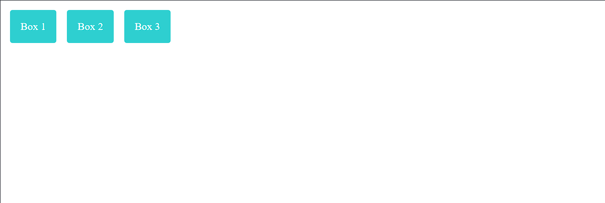

## Pengertian CSS Flexbox

Flexbox adalah sebuah layout model dalam CSS yang dirancang untuk mengatur atau menyusun elemen-elemen dalam sebuah kontainer beserta item didalamnya pada halaman web.

Flexbox bekerja dengan memberikan fleksibilitas dalam mengontrol bagaimana elemen-elemen berperilaku di halaman web. Baik saat ukuran layar berubah ataupun kontainernya.

## Fungsi Flexbox dalam pengembangan web

Flexbox memiliki beberapa fungsi dalam pengembangan web, yaitu:

1. **Mengatur tata letak secara responsif**: Flexbox memudahkan dalam mengatur elemen-elemen yang ada untuk menyesuaikan dengan ukuran layar yang berubah-ubah, terutama pada desain website yang responsif

2. **Kontrol urutan elemen (ordering)**: Dengan menggunakan flexbox, kita bisa mengatur urutan tampilan elemen secara mudah menggunakan properti `order` tanpa harus mengubah urutan HTMLnya 

3. **Mengatur distribusi ruang**: Flexbox memungkinkan kita mendistribusikan ruang antara dan di sekitar flex items dengan properti seperti `justify-content`, `align-items`, dan `align-content`.

4. **Fleksibilitas ukuran elemen**:  Flexbox memberikan kontrol yang baik atas bagaimana elemen-elemen dalam kontainer menyesuaikan ukurannya menggunakan properti `flex-grow`, `flex-shrink`, dan `flex-basis`.

:::info
Pembahasan untuk properti kita lanjut lebih dalam di materi selanjutnya
:::


## Cara Kerja Flexbox

Flexbox bekerja dengan mengatur tata letak elemen di dalam flex container. Untuk menggunakan flexbox kita menerapkan properti `display:flex` di file css pada kontainer. Setelah itu kita dapat menerapkan properti lain seperti `flex-direction`, `justify-content`, dan `align-items`.

Berikut merupakan contoh penggunaan Flexbox

File HTML :
```html
/* index.html */
<!DOCTYPE html>
<html lang="en">
<head>
  <meta charset="UTF-8">
  <meta name="viewport" content="width=device-width, initial-scale=1.0">
  <link rel="stylesheet" href="styles.css">
</head>
<body>
  <div class="flex-container">
    <div class="flex-item">Box 1</div>
    <div class="flex-item">Box 2</div>
    <div class="flex-item">Box 3</div>
  </div>
</body>
</html>
```

File CSS :
```css
/* style.css */
.flex-container {
    display: flex;
    background-color: white;
  }
  
  .flex-item {
    background-color: darkturquoise;
    color: white;
    padding: 20px;
    margin: 10px;
    font-size: 20px;
    text-align: center;
    border-radius: 5px;
  }
```
Pada `flex-container`, styling yang diberikan sangat berpengaruh terhadap elemen `flex-item`.


## Tantangan

Buat 3 persegi panjang yang ada pada kode disamping menjadi tersusun berbaris.

Hasil yang diharapkan seperti gambar dibawah ini



:::info
Fokus pada susunan saja, abaikan ukuran aslinya.
:::


## Kesimpulan

Flexbox adalah sebuah model layout CSS yang digunakan untuk mengatur atau menyusun sebuah kontainer beserta item didalamnya. Untuk menggunakan flexbox, tambahkan properti `display:flex` di file css.
