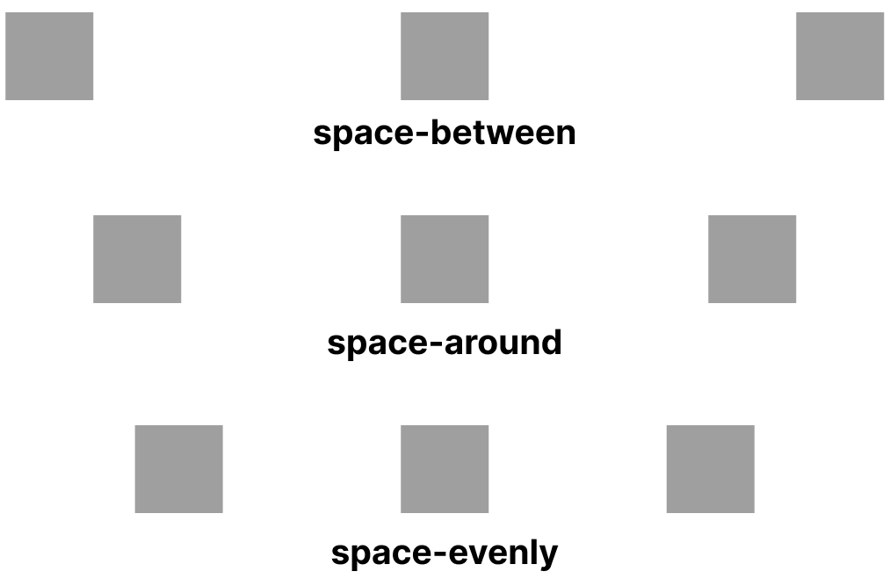

## Properti Flexbox

Sebelumnya di pengantar flexbox, kita dikenalkan beberapa properti flexbox. 

Penting kita menggunakan `display:flex` kalau ingin container kita menjadi blok dan mengakses properti flexbox. Saat ini kita akan mengenal properti flexbox yang sering digunakan dalam pembuatan website. Diantaranya :

1. **Flex-Direction**: `flex-direction` merupakan sebuah properti flexbox yang digunakan untuk mengatur arah tata letak dari flex items. Nilai properti untuk `flex-direction` ada `row`, `row-reverse`, `column`, dan `column-reverse`.

```css
.flex-container {
  display: flex;
  flex-direction: row | row-reverse | column | column-reverse;
}
```
Lalu apa arti dari value tersebut? Nah ada tabel nih untuk penjelasan tiap value yang dibeirkan

| Value | Keterangan |
|----------|----------|
|`row` (default)|Elemen yang diatur secara horizontal atau berbaris dari kanan ke kiri|
|`row-reverse`|Elemen yang diatur secara horizontal atau berbaris dari kiri ke kanan|
|`column`|Element yang diatur secara vertikal atau berkolom dari atas ke bawah|
|`column-reverse`|Element yang diatur secara vertikal atau berkolom dari bawah ke atas|

Masih belum tergambar? berikut merupakan contoh gambar untuk mempermudah pemahaman


2. **Justify-Content**: `justify-content` merupakan sebuah properti flexbox yang digunakna untuk mengatur bagaimana flex items didistribusikan. Nilai properti untuk `justify-content` ada `flex-start`,`flex-end`,`center`,`space-between`,`space-around`,`space-evenly`

```css
.flex-container {
  display: flex;
  justify-content: flex-start | flex-end | center | space-between | space-around | space-evenly
}
```

Sama seperti diatas, ada tabel untuk menjelaskan value dari `justify-content`

| Value | Keterangan |
|----------|----------|
|`flex-start` (default)|Elemen diatur dari tepi awal kontainer|
|`flex-end`|Elemen diatur dari tepi akhir kontainer|
|`flex-center`|Element diatur di tengah kontainer|
|`space-between`|Spasi di antara elemen sama, tanpa spasi di tepi|
|`space-around`|Spasi di antara elemen sama, dengan spasi di tepi juga|
|`space-evenly`|Spasi di antara elemen dan tepi sama|

Masih belum tergambar bagaimana value `justify-content` bekerja, tenang ada gambar dibawah ini untuk mempermudah pemahaman




3. **Align-Items**: `align-items` merupakan sebuah properti flexbox yang mengatur pemerataan flex items sepanjang Cross Axis/tegak lurus dengan Main Axis. Nilai properti `align-items` ada `stretch`, `flex-start`, `flex-end`, `center`, dan `baseline` 

```css
.flex-container {
  display: flex;
  align-items: stretch | flex-start | flex-end | center | baseline 
}
```

Sama seperti sebelumnya, ada tabel yang menjelaskan value dari `align-items`

| Value | Keterangan |
|----------|----------|
|`stretch` (default)|Flex items akan memenuhi kontainer|
|`flex-start`|Elemen diatur di awal Cross Axis|
|`flex-end`|Element diatur di akhir Cross Axis|
|`center`|Element diatur di tengah Cross Axis|
|`baseline`|Element diatur berdasarkan posisi garis dasar teks|

Mungkin agak membingungkan terkait Cross Axis ini bagaimana, tapi ada gambar untuk mempermudah pemahaman value `align-items` ini


4. **Align-Self**: `align-self` merupakan sebuah properti flexbox yang digunakan untuk mengatur salah satu flex item yang flex containernya memiliki properti align-items. Nilai properti `align-self` ada `auto`, `stretch`, `flex-start`, `flex-end`, `center`, dan `baseline`

```css
.flex-container {
  display: flex;
  align-items: stretch //sebagai contoh 
}

.flex-items2 {
  align-self: auto | stretch | flex-start | flex-end | center | baseline
}
```
Sama seperti sebelumnya, ada tabel yang menjelaskan value dari `align-self`

| Value | Keterangan |
|----------|----------|
|`auto` (default)|Mengikuti aturan align-items dari kontainer|
|`stretch`|Elemen memenuhi kontainer|
|`flex-start`|Elemen berada di awal Cross Axis|
|`flex-end`|Element berada di akhir Cross Axis|
|`center`|Element berada di tengah Cross Axis|
|`baseline`|Element berada berdasarkan posisi garis dasar teks|

Agar mudah dalam memahami `align-self` bekerja, berikut merupakan gambar untuk mempermudah pemahaman. Perhatikan unsur kotak nomor 2


## Tantangan

Tambahkan komentar pada kode CSS di atas untuk memberikan penjelasan tentang kode tersebut.