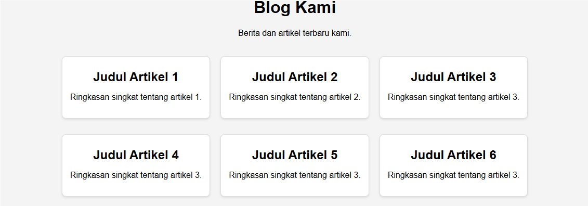

## Penerapan Flexbox

Kita sudah mengenal terkait apa itu flexbox, propertinya, dan apa saja nilai yang harus diberikan di propertinya. Namun bagaimana penerapan flexbox? Nah mari kita lihat contoh di bawah ini.

## Membuat Layout Kolom dengan Flexbox

File HTML

```html
/* index.html */
<!doctype html>
<html lang="en">
  <head>
    <meta charset="UTF-8" />
    <meta name="viewport" content="width=device-width, initial-scale=1.0" />
    <title>Flexbox Column Layout</title>
    <link rel="stylesheet" href="styles.css" />
  </head>
  <body>
    <div class="container">
      <div class="column">Kolom 1</div>
      <div class="column">Kolom 2</div>
      <div class="column">Kolom 3</div>
    </div>
  </body>
</html>
```

Nah html ini kan masih flex items belum menjadi sebuah kolom, lalu kita tambahkan file css dengan mempercantik column dan container serta membuat flex items bisa menjadi kolom.

```css
/* style.css */
.container {
  display: flex;
  justify-content: space-between;
  padding: 20px;
  background-color: #f2f2f2;
}

.column {
  background-color: #4caf50;
  color: white;
  padding: 20px;
  flex: 1;
  margin: 0 10px;
  text-align: center;
}
```

Apakah sudah cukup? iya, namun kita ingin agar flex items bisa diakses jika panjang layarnya seperti hp.

## Mengimplementasikan Layout Sebelumnya Menjadi Responsif Dengan Flexbox

Untuk layout kita menjadi lebih responsif, kita dapat mengimplementasikan media query nih!

Tambahkan kode css berikut dibawah styles.css

```css
@media (max-width: 768px) {
  .container {
    flex-direction: column;
    align-items: stretch;
  }

  .column {
    margin: 10px 0;
  }
}
```

Sekarang kalian coba perkecil ukuran web browser kalian atau gunakan inspect dan klik device toolbar dan lihat hasilnya!

## Tantangan

Perbaikilah kode css berikut, baik untuk layout yang ditunjukan di layar dan layout responsifnya

Hasil yang diharapkan seperti gambar dibawah ini



untuk hasil responsifnya


